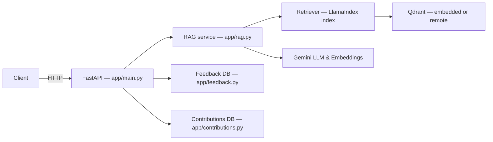
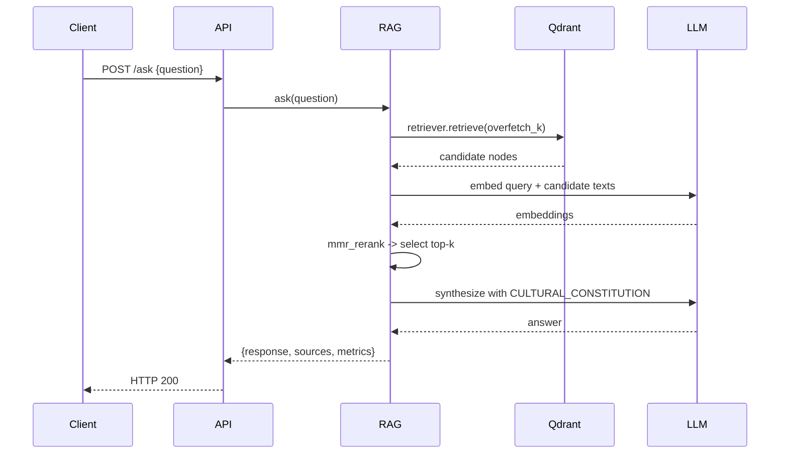
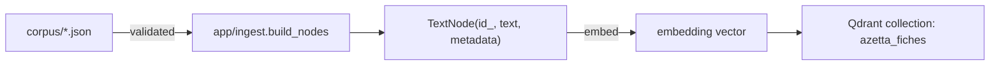
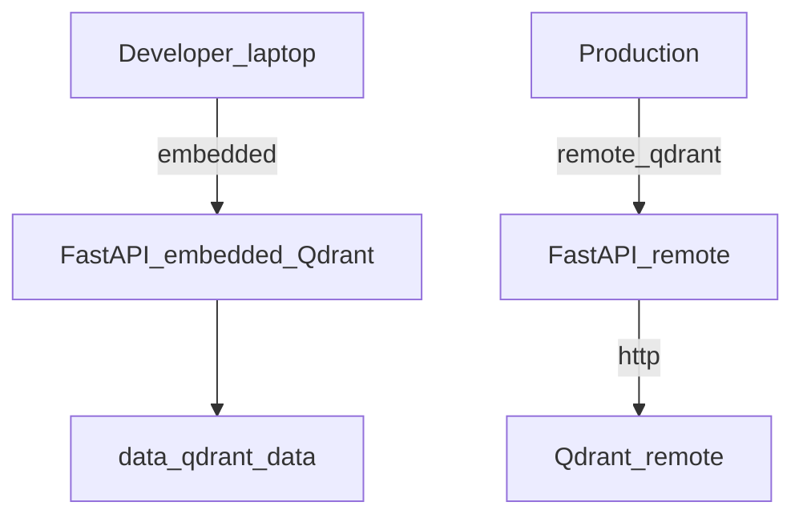
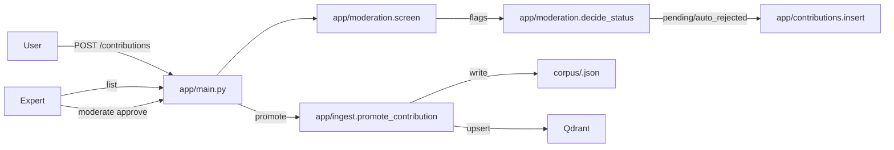

# Azetta — Developer Documentation

Comprehensive developer guide for the `azetta-backend` (RAG anti-lissage for Amazigh craft knowledge).

This document covers architecture, setup, ingestion, runtime, API reference, internals (MMR + constitution), data model, contribution moderation flow, deployment notes, metrics, and troubleshooting. Diagrams are provided as Mermaid blocks and can be rendered by GitHub/VS Code Preview.

**Quick links**
- Repository root: `README.md` (short summary)
- Main API: `app/main.py`
- Ingest: `app/ingest.py`
- RAG engine: `app/rag.py`
- Config: `app/config.py`
- Metrics: `app/metrics.py`

---

## 1. Overview

Azetta is a retrieval-augmented system designed to answer questions about Amazigh crafts and traditions while avoiding cultural "lissage" (smoothing). It uses:

- LlamaIndex (core) for node and index abstractions
- Gemini (Google GenAI) as LLM and embeddings
- Qdrant as the vector store (embedded by default)
- FastAPI for the HTTP API

The system's core idea: retrieve multiple candidate sources, apply Maximal Marginal Relevance (MMR) to maximize diversity, and synthesize an answer under a strict "cultural constitution" system prompt so responses remain faithful and sourced.

---

## 2. Quickstart (developer)

Prerequisites: Python >= 3.12, project dependencies installed via `uv` (see `pyproject.toml`). Set your Gemini API key in `.env`.

Commands (copy-paste):

```bash
uv sync
cp .env.example .env
# Edit .env and set GEMINI_API_KEY or GOOGLE_API_KEY
uv run python -m app.ingest          # build or load index
uv run uvicorn app.main:app --port 8000
```

Open the interactive API docs at http://localhost:8000/docs

---

## 3. Installation & Env

- Install pinned deps: `uv sync`.
- Copy `.env.example` → `.env` and fill `GEMINI_API_KEY` (or `GOOGLE_API_KEY`).

Important config lives in `app/config.py`. Key environment-aware knobs:

- `GEMINI_API_KEY`, `AZETTA_LLM_MODEL`, `AZETTA_EMBED_MODEL`
- `EMBED_DIM` (must match the Qdrant collection vector size)
- `COLLECTION_NAME` (Qdrant collection)
- Retrieval and anti-lissage: `OVERFETCH_K`, `SIMILARITY_TOP_K`, `MMR_LAMBDA`, `ROUTER_SCORE_THRESHOLD`

---

## 4. Ingesting the Corpus

Corpus files: one JSON fiche per file under the `corpus/` directory. Each fiche must include the schema:

- `id`, `categorie`, `titre`, `contenu`, `region`, `termes_amazighs` (array), `elements_culturels` (array), `source`, `fiabilite`

To (re)build the index:

```bash
uv run python -m app.ingest         # uses embedded Qdrant; builds if missing
uv run python -m app.ingest --force # drop & rebuild collection
```

Implementation notes:

- `app/ingest.py::build_index()` validates every JSON fiche and converts each fiche to a single `TextNode` (no chunking). `id_` is a deterministic UUID (`fiche_uuid`) derived from the fiche id so re-ingestion upserts instead of duplicating.
- Embedded Qdrant uses `data/qdrant_data/` by default. To use a remote Qdrant server, replace `get_client()` in `app/ingest.py` with `QdrantClient(url="http://localhost:6333")`.

---

## 5. Run the API

Run a single worker (embedded Qdrant takes an exclusive lock — do not use `--reload`):

```bash
uv run uvicorn app.main:app --port 8000
```

Endpoints (primary):

- `POST /ask` — question -> `{response, source_nodes, metrics}`
- `POST /compare` — runs RAG vs baseline LLM (for lissage detection)
- `POST /chat` — routed chat with per-chat memory
- `POST /feedback` — record user votes/corrections (HITL loop)
- `POST /contributions` — submit a new fiche candidate
- `GET /contributions` — moderation queue listing
- `POST /contributions/{id}/moderate` — approve/reject a contribution (approve triggers re-index via `app/ingest.promote_contribution`)

Refer to `app/main.py` for Pydantic schemas and payload validation.

### Example: `POST /ask`

Request example:

```json
{ "question": "Que signifie le losange dans le tissage amazigh ?" }
```

Response shape (example):

```json
{
  "response": "...",
  "source_nodes": [ { "id": "...", "titre": "...", "region": "...", "score": 0.83 } ],
  "metrics": { "cultural_coverage": { "percent": 42.0 }, "other_metrics": {} }
}
```

---

## 6. RAG internals

The RAG pipeline lives in `app/rag.py`. Key components:

- Retrieval: uses `index.as_retriever(similarity_top_k=OVERFETCH_K)` to overfetch candidates.
- Diversity re-ranking: `mmr_rerank(query_emb, cand_embs, k, lambda_)` implements Maximal Marginal Relevance.
- Synthesis: builds the system prompt called the `CULTURAL_CONSTITUTION` (an imperative set of rules) and synthesizes the final answer over the selected nodes.

Routing (agentic): `ask_routed()` first gates using the bare question to decide whether to answer directly with the LLM (no retrieval) or run the cultural RAG path, based on `ROUTER_SCORE_THRESHOLD`.

Important functions and references:

- `app/rag.py::mmr_rerank` — MMR implementation (numpy).
- `app/rag.py::CULTURAL_CONSTITUTION` — the system prompt enforcing cultural fidelity.
- `app/rag.py::ask()` — RAG answer flow.
- `app/rag.py::ask_baseline()` — baseline LLM answer (no retrieval/constitution) used by `/compare`.

---

## 7. Data model

- Source artifacts are JSON fiches under `corpus/`.
- Each fiche → a single `TextNode` with metadata (fiche_id, titre, region, source, categorie, termes_amazighs, elements_culturels, fiabilite).
- Embeddings are created by the configured Gemini embedding model; dimensionality is pinned by `EMBED_DIM` in `app/config.py` and must match the Qdrant collection.

---

## 8. Contribution moderation flow

Flow summary:

1. Public user posts `POST /contributions` with a candidate fiche.
2. `app/moderation.py::screen()` runs auto-filters (spam, duplicate detection using embeddings, heuristic checks).
3. `app/moderation.py::decide_status()` returns `pending` or `auto_rejected`.
4. Experts call `POST /contributions/{id}/moderate` to `approve` or `reject`.
5. `approve` triggers `app/ingest.promote_contribution()` which writes a new `corpus/<id>.json` and upserts the node into the live Qdrant collection.

---

## 9. Deployment & Embedded Qdrant notes

- Embedded (default): Qdrant persists to `data/qdrant_data/` and is accessed with `QdrantClient(path=config.QDRANT_PATH)`. The embedded store holds an exclusive file lock — run a single worker and avoid `uvicorn --reload`.
- Server mode: use a networked Qdrant and update `get_client()` in `app/ingest.py` to `QdrantClient(url='http://<host>:6333')`. In server mode you can run multiple app workers.

---

## 10. Metrics & verification

`app/metrics.py` exposes helpers used in API responses to compute cultural coverage and related metrics. Use `/compare` to measure delta between the RAG path and baseline LLM.

Recommended verification steps after ingest:

1. Run a few on-topic `POST /ask` requests and verify `source_nodes` are non-empty.
2. Check `metrics.cultural_coverage.percent` is reasonable for known topics.
3. For duplicate-detection tuning, adjust `DUPLICATE_SCORE_THRESHOLD` in `app/config.py`.

---

## 11. Troubleshooting

- If LlamIndex attempts to contact OpenAI: ensure `app.config.configure_settings()` runs early (it is called at app startup and in `ingest.build_index`) and that `GEMINI_API_KEY` is set.
- If `app.ingest` fails with Qdrant path issues: ensure `data/` is writable and no other process holds the embedded DB lock.
- If embeddings dimensions mismatch: confirm `EMBED_DIM` in `app/config.py` matches the embedding model output and the Qdrant collection vector size. Recreate the collection with `--force` if you change embed dims.

---

## 12. Diagrams (Mermaid)

### 12.1 Architecture (components & data flow)



### 12.2 Sequence: POST /ask → RAG → Response



### 12.3 Data model flow (fiche → TextNode → vector)



### 12.4 Deployment (embedded vs server Qdrant)



### 12.5 Contribution moderation flow



---

## 13. Contributing

If you want to extend the backend:

1. Fork the repo and create a feature branch.
2. Run `uv sync` and add tests where appropriate.
3. Keep changes small and focused: update `docs/README.md` when adding features.

---

## 14. File references

- API: `app/main.py`
- Ingest / index: `app/ingest.py`
- RAG core: `app/rag.py`
- Config: `app/config.py`
- Metrics: `app/metrics.py`
- Moderation: `app/moderation.py`

---

## 15. Deep Architecture and Component Responsibilities

This section documents each runtime component, its responsibilities, and runtime interactions.

- `FastAPI` (`app/main.py`): HTTP surface, request validation (Pydantic), startup `lifespan` that pre-warms the index, DBs and global settings. Keep this layer as thin as possible — business logic lives in `app/rag.py`, `app/ingest.py`, and `app/moderation.py`.
- `RAG service` (`app/rag.py`): orchestrates retrieval, MMR-based diversity re-ranking, and answer synthesis under the `CULTURAL_CONSTITUTION` prompt. Exposes `ask()`, `ask_baseline()` and `ask_routed()` for different flows.
- `Index` (LlamaIndex VectorStoreIndex backed by Qdrant): stores `TextNode`s built from `corpus/*.json`. Retrieval is performed via `index.as_retriever()`.
- `Qdrant` (embedded or remote): persistent vector store. Embedded mode is simpler for single-developer runs; remote mode enables multiple worker processes.
- `Gemini` (LLM + embeddings): used for both embeddings and text completion. Injected into LlamaIndex via `app/config.configure_settings()`.
- `Moderation` and `Contributions` (`app/moderation.py`, `app/contributions.py`): implement auto-filtering, duplicate detection, persistence of submissions, and expert workflows.
- `Metrics` (`app/metrics.py`): computes cultural coverage and other signals used to explain anti-lissage performance.

### Inter-component contracts

- Embeddings: `Settings.embed_model` must produce vectors of size `EMBED_DIM`. If the dimensionality changes, recreate the Qdrant collection with `--force`.
- Node IDs: a deterministic UUID derived from `fiche.id` (`app/ingest.fiche_uuid`) is used as the point id so re-ingestion upserts.

## 16. MMR and Math (why it matters)

MMR (Maximal Marginal Relevance) trades off relevance against redundancy to produce a diverse set of sources. Implementation details live in `app/rag.py::mmr_rerank`.

Let $q$ be the query embedding and $c_i$ candidate embeddings. The MMR selection greedily maximizes:

$$\text{score}(i) = \lambda \cdot \text{sim}(q, c_i) - (1-\lambda) \cdot \max_{j\in S} \text{sim}(c_i, c_j)$$

where $S$ is the set of already-selected indices, $\text{sim}$ is cosine similarity, and $\lambda\in[0,1]$ is `MMR_LAMBDA` (higher = more relevance, lower = more diversity).

Practical tips:

- `OVERFETCH_K` should be >= `SIMILARITY_TOP_K` * 3 to give MMR room to pick diverse items. The project defaults (`OVERFETCH_K=15`, `SIMILARITY_TOP_K=5`) are a good starting point.
- Tune `MMR_LAMBDA` between 0.5 and 0.8. Lower values increase novelty but risk off-topic picks; higher values reduce diversity.

## 17. Embedding & Vector Store Considerations

- Embedding model output dimensionality must match `EMBED_DIM`. If you change model, set `EMBED_DIM` accordingly and re-run `app.ingest --force`.
- Qdrant collection metadata keeps `fiche_id` for human-readable citation; Qdrant point ids are stable UUIDs.
- For large corpora, consider chunking fiches into smaller nodes. This repo intentionally uses one fiche → one node for provenance clarity.

## 18. Tuning Guide

Small checklist when results look "too averaged" (lissage):

1. Decrease `MMR_LAMBDA` to favor diversity (e.g., 0.5).
2. Increase `OVERFETCH_K` to allow the reranker more candidates (e.g., 20).
3. Lower `ROUTER_SCORE_THRESHOLD` only if the router is falsely rejecting relevant queries.
4. Inspect `source_nodes` returned for a few queries to confirm regional variety.

## 19. API Reference (detailed)

All request/response validation is defined in `app/main.py` using Pydantic models. Key schemas:

- `AskRequest`: `{ question: str }`
- `AskResponse`: `{ response: str, source_nodes: list[SourceNode], metrics: dict }`
- `SourceNode`: `{ id, titre, region, source, categorie, fiabilite, score }`

Example `curl` call (ask):

```bash
curl -sS -X POST http://localhost:8000/ask \
  -H 'Content-Type: application/json' \
  -d '{"question":"Comment se fait la teinture naturelle de l'azetta ?"}'
```

Python client example (requests):

```python
import requests

resp = requests.post('http://localhost:8000/ask', json={'question': 'Que signifie yaz dans le tissage?'})
print(resp.json())
```

## 20. Example response (sanitized)

```json
{
  "response": "Le yaz est un motif en forme de losange... (cited)",
  "source_nodes": [
    {"id":"bijou_argent_tiznit","titre":"La fibule...","region":"Tiznit","score":0.8321},
    {"id":"motif_yaz","titre":"Motif yaz","region":"Kabylie","score":0.7214}
  ],
  "metrics": {"cultural_coverage": {"percent": 72.3}}
}
```

## 21. Testing & CI

Recommendations for automated checks:

- Add a small pytest suite that validates `app.ingest.load_fiches()` can read `corpus/` files and that `app.ingest.build_nodes()` produces `TextNode`-like dictionaries. Use mocking/stubbing for embeddings/Qdrant in CI.
- Include a docs build check (markdownlint) and a Mermaid syntax check (optional) in GitHub Actions.

Example GitHub Actions matrix step (pseudo):

```yaml
name: CI
on: [push, pull_request]
jobs:
  lint-and-test:
    runs-on: ubuntu-latest
    steps:
      - uses: actions/checkout@v4
      - name: Setup Python
        uses: actions/setup-python@v4
        with: {python-version: '3.12'}
      - name: Install deps
        run: pip install -r requirements-dev.txt
      - name: Run tests
        run: pytest -q
```

## 22. Advanced Troubleshooting

- Mermaid render errors on GitHub: keep node labels simple (avoid unescaped backticks, parentheses, slashes). If a complex label is required, place it in a separate caption paragraph and use a short node id in the diagram.
- Qdrant embedded lock: error like "database locked" means another process has the embedded store open. Stop other uvicorn/ingest processes before restarting. For CI, mock Qdrant or use a networked Qdrant instance.
- Gemini / LlamaIndex falling back to OpenAI: ensure `app.config.configure_settings()` is called before any LlamaIndex operations and that `GEMINI_API_KEY` is present.

## 23. Security & Privacy

- Do not log sensitive user-provided data. The current code records feedback and contributions intentionally — ensure PII is handled according to your privacy policy.
- API keys: keep `.env` out of git; use secrets in production. In GitHub Actions, store `GEMINI_API_KEY` as a repository secret.

## 24. What's Next (suggestions)

- Add end-to-end integration tests with a small local Qdrant server to validate retrieval + MMR semantics.
- Add an `examples/` folder with sample `curl` and Python scripts for every endpoint.
- Export Mermaid diagrams as PNGs into `docs/diagrams/` for platforms that don't render Mermaid.

End of developer documentation.
